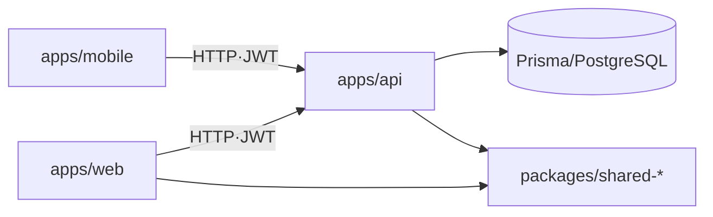

# AbleWork ERP — Claude Code 가이드

> 중소기업(50~300인)용 통합 ERP: 인사/근태 + 전자결재 + Discord 알림.
> 이 파일은 **네비게이션 허브**다 — 상세는 모듈 `CLAUDE.md`·[`docs/adr/`](docs/adr/README.md)·[`docs/design/`](docs/design/README.md)로 위임한다.

## 1. 구현 범위 (NEVER — 절대 구현 금지)

- **급여 정산(payroll)**: `payroll_periods`·`payroll_records` 테이블, 관련 API/UI 금지
- **전자계약**: 글로싸인/모두싸인 연동 금지 · **급여명세서 메시지**(`messageUseCasePaySlip`) 금지
- **Enterprise 전용**: 생체인증, 2FA, IP 화이트리스트, 스케줄 게시(publish), 비례 연차 발생 금지
- **Repository 계층** 별도 클래스 금지 — Service에서 PrismaService 직접 사용([ADR-0001](docs/adr/0001-no-repository-layer.md))
- **Tailwind 금지** — MUI 사용 · **마이그레이션 파일 없이 DB 스키마 직접 변경 금지**

## 2. 스택

```
Backend  NestJS 11 · Prisma 6 · PostgreSQL 16 · Redis 7 · BullMQ 5
Frontend Next.js 15 (App Router) · MUI 6 · TanStack Query v5 · Zustand 5
공유      TypeScript 5 · Zod 3 (FE/BE 공유) · pnpm · Turborepo · 브랜드색 #f36f20
```

구조·데이터 흐름 개요 → [`docs/ARCHITECTURE.md`](docs/ARCHITECTURE.md).



## 3. 모듈 가이드 (각 워크스페이스의 CLAUDE.md)

| 모듈 | 가이드 |
|---|---|
| 백엔드 | [`apps/api/CLAUDE.md`](apps/api/CLAUDE.md) |
| 프런트엔드 | [`apps/web/CLAUDE.md`](apps/web/CLAUDE.md) |
| 모바일 | [`apps/mobile/CLAUDE.md`](apps/mobile/CLAUDE.md) |
| 공유 계약 | [`packages/shared-constants/CLAUDE.md`](packages/shared-constants/CLAUDE.md) · [`packages/shared-schemas/CLAUDE.md`](packages/shared-schemas/CLAUDE.md) · [`packages/shared-types/CLAUDE.md`](packages/shared-types/CLAUDE.md) |
| 배포 | [`deploy/CLAUDE.md`](deploy/CLAUDE.md) |

## 4. 반드시 지킬 규칙 (안전·정합)

- **멀티테넌시**: 모든 DB 쿼리 `where`에 `companyId`를 **반드시** 포함 — 누락 시 타 회사 데이터 노출([ADR-0002](docs/adr/0002-multitenancy-companyid.md)).
- **레이어**: `Controller → Service → PrismaService(직접)`. 복잡 쿼리는 Service private 메서드.
- **권한**: `SUPER_ADMIN(4) > GENERAL_ADMIN(3) > ORG_ADMIN(2) > EMPLOYEE(1)`. SSOT는 [`packages/shared-constants/src/permissions.ts`](packages/shared-constants/src/permissions.ts).
- **API 응답**: `{ success, data, error }` envelope 자동 래핑. 에러코드는 `[도메인]_[상황]`(예: `LEAVE_BALANCE_INSUFFICIENT`).
- **네이밍**: 파일 kebab-case · 클래스 PascalCase · DB 컬럼 snake_case · Prisma 필드 camelCase. 단일 파일 800줄·함수 50줄 초과 금지.

## 5. 핵심 비즈니스 흐름 (근거는 ADR)

- **HR 요청 → 전자결재 자동 연동**: `$transaction`으로 requests+documents+approval_lines/steps 원자 생성 → 상신. 흐름도는 [`docs/ARCHITECTURE.md`](docs/ARCHITECTURE.md).
- **전자결재 상태 머신 · 첨부 DRAFT 한정 · 재상신 폐지** → [ADR-0004](docs/adr/0004-approval-state-machine.md).
- **승인자 이원화**(HR 요청 부서 승인자 ≠ 전자결재 결재선) → [ADR-0003](docs/adr/0003-hr-request-approval-dualtrack.md).
- 근태 판정·휴가 잔액·회사 설정 등 상세 룰 → [`docs/design/SYSTEM_DESIGN.md`](docs/design/SYSTEM_DESIGN.md).

## 6. 개발 · 테스트 명령

```bash
docker compose up -d                       # 인프라(postgres·redis·minio)
pnpm install && pnpm --filter api prisma migrate dev && pnpm --filter api prisma db seed
pnpm dev                                   # 개발 서버 (API는 ts-node — 코드 수정 후 수동 재시작, ADR-0005)

pnpm test                                  # Jest 단위+통합
pnpm typecheck && pnpm lint                # 타입체크·린트
pnpm check:context-paths                   # 컨텍스트 문서 경로 참조 검증(AI-Readiness E1)
pnpm --filter api prisma migrate dev --name <이름>   # 스키마 변경 후 필수 + prisma generate
```

로컬 상세·포트·트러블슈팅 → [`README.md`](README.md).

## 7. 참조 문서 (SSOT)

| 문서 | 내용 |
|---|---|
| [`docs/design/CHANGELOG.md`](docs/design/CHANGELOG.md) | **변경 이력 SSOT** — 작업/추적/롤백 판단 시 먼저 읽고, 변경 후 갱신 |
| [`docs/ARCHITECTURE.md`](docs/ARCHITECTURE.md) | 구조·모듈 의존·데이터 흐름 개요 |
| [`docs/adr/README.md`](docs/adr/README.md) | 설계 결정 근거(ADR) |
| [`docs/design/SYSTEM_DESIGN.md`](docs/design/SYSTEM_DESIGN.md) | 아키텍처·모듈·API·연동 플로우 상세 |
| [`docs/design/ERD.md`](docs/design/ERD.md) | 테이블 ERD + company_settings 키 |
| [`docs/design/FEATURE_LIST.md`](docs/design/FEATURE_LIST.md) | 기능·우선순위·화면 경로 |
| [`docs/design/THEMING.md`](docs/design/THEMING.md) | 멀티 테마(6종) 토큰 SSOT |
| [`docs/design/AWS_OPERATIONS.md`](docs/design/AWS_OPERATIONS.md) | AWS 운영 런북(다른 세션 AWS 작업 시 먼저 읽을 것) |
| [`docs/design/SELF_CHECK_LOOP.md`](docs/design/SELF_CHECK_LOOP.md) | 자가점검·자가수정 루프 규격 |
| [`evals/README.md`](evals/README.md) | AI 에이전트 성과 측정 — 대표 task pass-rate |

> **에이전트 성과 텔레메트리(agent telemetry)**: AI 코딩 에이전트의 task별 성공률은 [`evals/agent-results.json`](evals/agent-results.json)에 기록하고, 자율 수정 루프의 세션 로그는 [`SELF_CHECK_LOOP.md`](docs/design/SELF_CHECK_LOOP.md) 규격을 따른다. 회귀는 `pnpm check:evals`가 CI에서 하네스 무결성으로 차단(pass-rate 실측은 수동 갱신).
