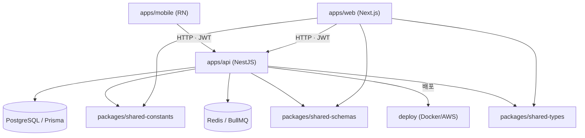
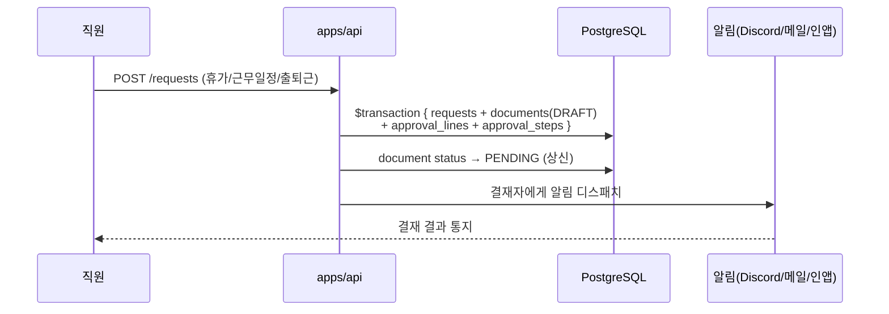

# AbleWork 아키텍처

> 시스템 구조·모듈 의존·핵심 데이터 흐름의 개요. 상세 설계는 [`docs/design/SYSTEM_DESIGN.md`](design/SYSTEM_DESIGN.md),
> 테이블은 [`docs/design/ERD.md`](design/ERD.md)를 본다.

## 스택

```
Backend  : NestJS 11 + Prisma 6 + PostgreSQL 16 + Redis 7 + BullMQ 5
Frontend : Next.js 15 (App Router) + MUI 6 + TanStack Query v5 + Zustand 5
Mobile   : React Native (Expo Router)
공유      : TypeScript 5, Zod 3 (FE/BE 스키마 공유), pnpm + Turborepo
```

## 모듈 의존 그래프



`packages/*`(shared-constants·shared-schemas·shared-types)는 FE·BE가 함께 의존하는
**공유 계약 허브**다. 여기가 바뀌면 양쪽 빌드에 파급되므로, 변경 시 두 앱의 타입체크를
함께 돌린다.

## 백엔드 레이어

```
Controller → Service → PrismaService(직접)
```

Repository 계층을 두지 않는다(→ [ADR-0001](adr/0001-no-repository-layer.md)). 모든 쿼리에
`companyId`를 강제한다(→ [ADR-0002](adr/0002-multitenancy-companyid.md)).

## 핵심 흐름: HR 요청 → 전자결재 자동 연동



문서 상태 머신·첨부 정책은 [ADR-0004](adr/0004-approval-state-machine.md),
승인자 이원화는 [ADR-0003](adr/0003-hr-request-approval-dualtrack.md) 참조.

## 배포

main 병합 시 GitLab CI(`.gitlab-ci.yml`)가 arm64 buildx → ECR → EC2(SSM) 순으로 자동
배포한다. 운영 런북은 [`docs/design/AWS_OPERATIONS.md`](design/AWS_OPERATIONS.md).

## 더 보기

- 모듈별 가이드: [`apps/api/CLAUDE.md`](../apps/api/CLAUDE.md) · [`apps/web/CLAUDE.md`](../apps/web/CLAUDE.md) · [`packages/shared-constants/CLAUDE.md`](../packages/shared-constants/CLAUDE.md)
- 결정 근거: [`docs/adr/`](adr/README.md)
